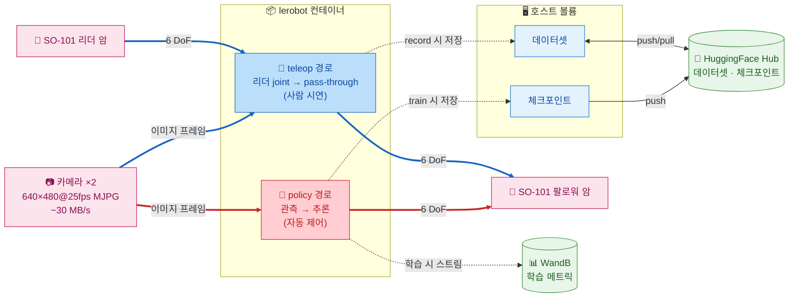

# SO-ARM101 VLA Control System

SO-ARM101 6축 로봇 팔용 **Docker 기반 LeRobot 파이프라인**. `docker/docker-compose.yaml` 의 `lerobot` 서비스 단일 진입점(`docker/lerobot-entrypoint.sh`)을 통해 텔레오퍼레이션·데이터 수집·정책 학습·추론·시각화를 모두 수행한다. 호스트에는 Docker / GPU 드라이버 / (Windows의 경우) usbipd-win 만 갖추면 되고, Python·CUDA·LeRobot·서보 SDK 등 일체는 컨테이너 안에 격리되어 있다.

> 시뮬레이션 경로(LeIsaac + Isaac Sim)는 현재 `docker-compose.yaml` 에서 임시 비활성화되어 있다. 관련 Dockerfile (`docker/Dockerfile.leisaac`) 은 보존만 되어 있으며 본 README 는 실기기 경로만 다룬다.

## 목차 <!-- omit in toc -->

- [아키텍처](#아키텍처)
- [환경 요구사항](#환경-요구사항)
- [설치 및 사용 방법](#설치-및-사용-방법)
- [Reference](#reference)


## 아키텍처



### 핵심 포인트

- **단일 컨테이너 / 다중 모드**: `entrypoint.sh` 의 첫 인자가 모드를 결정한다. README 의 모든 명령은 동일한 컨테이너에서 실행되며, 모드별로 필요한 env var 와 디바이스만 다르다.

## 환경 요구사항

### 소프트웨어

| 항목 | 버전 | 비고 |
|------|------|------|
| Ubuntu 24.04 | (Windows)WSL2 커널 6.6+ 권장 |
| Docker | 최신 | (Windows)WSL2 backend 활성화 필수 |
| usbipd-win | 5.0 이상 | (Windows)USB 장치 WSL2 포워딩 |
| NVIDIA Driver | 580 이상 | CUDA 컨테이너 실행용 |
| NVIDIA Container Toolkit | 12.8 이상 | Docker GPU 지원 |
| Hugging Face 계정 | - | 데이터셋·모델 업로드·다운로드용 |
| W&B 계정 | - | 모델 학습 기록용 |

### 하드웨어

| 장치 | 수량 | 비고 |
|------|------|------|
| NVIDIA GPU | 1개 이상 | CUDA 가속 학습/추론용. VRAM 16 GB 이상 권장(RTX 4080 / 5080 / RTX A4000 등) |
| SO-101 Leader Arm | 1 | Feetech STS3215 서보 |
| SO-101 Follower Arm | 1 | Feetech STS3215 서보 |
| USB-Serial 어댑터 | 2 | CH343 칩 (COM 포트) |
| 카메라 | 2 | belly cam (전면), wrist cam (손목) |

### 핵심 의존성

버전은 `pyproject.toml` 에 고정. 컨테이너 빌드 시 `uv sync --only-group teleop` 으로 설치된다.

| 패키지 | 버전 | 비고 |
|--------|------|------|
| Python | 3.11 | - |
| torch  | 2.7.0 | cu128 |
| isaacsim | 5.1.0 | `[all,extscache]` extras 포함 |
| isaaclab | 2.3.0 | `leisaac[isaaclab]` 로 간접 설치 |
| leisaac | 0.4.0 | `pyproject.toml` 의 `[tool.uv.sources]` 가 git tag `v0.4.0` 에서 설치 |
| lerobot | 0.4.4 | - |

## 설치 및 사용 방법

### LeRobot 이미지 빌드

`lerobot` 서비스 이미지는 `docker/Dockerfile.lerobot` (6-stage: base → uv → python 3.11 → torch(cu128) → teleop deps → app) 로 빌드된다.

```bash
docker compose -f docker/docker-compose.yaml build lerobot
```

### (WSL)USB 포트 연결

SO-101 Leader Arm, Follower Arm, 카메라들을 컴퓨터에 연결

이후 관리자 권한으로 powershell 열어서 usbipd 설치 후 포트 바인딩 진행

```powershell
# usbipd 설치
winget install usdipd
# 포트 목록 조회
usbipd list
# 최초 1회만 실행
usbipd bind --busid <leader-port>
usbipd bind --busid <follower-port>
usbipd bind --busid <wrist-cam-port>
usbipd bind --busid <belly-cam-port>
# usb 재연결할 때마다 / WSL 리부트할 때마다 실행
usbipd attach --wsl --busid <leader-port>
usbipd attach --wsl --busid <follower-port>
usbipd attach --wsl --busid <wrist-cam-port>
usbipd attach --wsl --busid <belly-cam-port>
# Windows로 포트를 되돌릴 경우:
usbipd detach --busid <port>
```

이후 wsl에서 포트 권한 설정 진행

```bash
# Leader Arm, Follower Arm USB
sudo chmod 666 /dev/ttyACM0 /dev/ttyACM1
# Wrist Cam, Belly Cam
sudo chmod 666 /dev/video0 /dev/video2
sudo usermod -aG dialout $USER
```

### .env 파일 작성

`.env.example` 파일을 `.env` 파일로 복사한 후 다음 값을 입력. `docker compose` 가 `--env-file .env` 로 컨테이너에 주입한다.

| 이름 | 설명 |
|-----|------|
|HF_TOKEN | Hugging Face 토큰(발급: [Hugging Face settings](https://huggingface.co/settings/tokens)) |
| HF_USER | Hugging Face 계정 이름 |
| WANDB_API_KEY | Weight & Bias API 키(발급: [wandb 설정](https://wandb.ai/settings)) |

```bash
cp .env.example .env
```

### Entrypoint 모드 일람

모든 명령은 다음 패턴으로 호출한다.

```bash
docker compose --env-file .env -f docker/docker-compose.yaml run --rm lerobot <mode> [args...]
```

`<mode>` 가 곧 `entrypoint.sh` 첫 인자다. 모드별 동작과 핵심 env var 요약:

| 모드 | 설명 | 필요 하드웨어 | 핵심 env var |
|---|---|---|---|
| `teleop` | 리더→팔로워 실시간 원격 조작 | Leader + Follower + 카메라 | `TELEOP_PORT`, `ROBOT_PORT`, `*_CAM_PORT`, `CAM_*` |
| `record` | 텔레옵 기반 데이터셋 수집 | Leader + Follower + 카메라 | `HF_DATASET_REPO_ID`, `SINGLE_TASK`, `NUM_EPISODES`, `EPISODE_TIME_S`, `RESET_TIME_S`, `RECORD_FPS`, `PUSH_TO_HUB` |
| `replay` | 녹화 에피소드를 팔로워에 재실행 | Follower only | `HF_DATASET_REPO_ID`, `EPISODE_INDEX` |
| `calibrate` | 리더 또는 팔로워 영점 보정 | 한쪽만 | `CALIBRATE_TARGET` (`robot` \| `teleop`) |
| `setup-motors` | Feetech 모터 ID/Baud 초기 설정 | 한쪽만 | `CALIBRATE_TARGET` |
| `find-joint-limits` | 관절 가동 범위 탐색 | Leader + Follower | `TELEOP_TIME_S` |
| `find-cameras` | 시스템 카메라 자동 검출 | - | 위치 인자: `opencv` \| `realsense` |
| `find-port` | 직렬 포트 자동 감지 (인터랙티브) | - | - |
| `dataset-viz` | Rerun 기반 데이터셋 시각화 | - | `HF_DATASET_REPO_ID`, `EPISODE_INDEX`, `VIZ_MODE`, `VIZ_WS_PORT` |
| `train` | Policy 학습 (인자 완전 위임) | GPU 권장 | CLI 인자로 직접 전달 |
| `eval` | Policy 평가/롤아웃 (인자 완전 위임) | GPU 권장 | CLI 인자로 직접 전달 |
| `edit-dataset` | 데이터셋 편집 (인자 완전 위임) | - | CLI 인자로 직접 전달 |
| `info` | LeRobot / Python / 시스템 정보 | - | - |
| `bash` \| `shell` | 컨테이너 인터랙티브 쉘 | - | - |
| `python <args>` | 컨테이너 내 Python 실행 | - | - |

### SO-101 Motor Setup

`.env` 파일에서 다음 인자들을 입력하고 docker 명령어 실행

| 이름 | 설명 |
|---|-----|
| CALIBRATE_TARGET | `robot`: 팔로워 암 모터 설정, `teleop`: 리더 암 모터 설정 |
| TELEOP_PORT | 리더 암 포트(예: `/dev/ttyACM0`) |
| ROBOT_PORT | 팔로워 암 포트(예: `/dev/ttyACM1`) |

```bash
# CALIBRATE_TARGET을 robot / teleop으로 설정하고 각각 1회 실행
docker compose --env-file .env -f docker/docker-compose.yaml run \
    --rm lerobot setup-motors
```

### SO-101 Calibration

`.env` 파일에서 다음 인자들을 입력하고 docker 명령어 실행

| 이름 | 설명 |
|---|-----|
| CALIBRATE_TARGET | `robot`: 팔로워 암 보정, `teleop`: 리더 암 보정 |
| TELEOP_PORT | 리더 암 포트(예: `/dev/ttyACM0`) |
| TELEOP_ID | 리더 암 아이디(예: `so101_teleop`) |
| ROBOT_PORT | 팔로워 암 포트(예: `/dev/ttyACM1`) |
| ROBOT_ID | 팔로워 암 아이디(예: `so101_robot`) |

```bash
# CALIBRATE_TARGET을 robot / teleop으로 설정하고 각각 1회 실행
docker compose --env-file .env -f docker/docker-compose.yaml run \
    --rm lerobot calibrate
```

### SO-101 Teleoperation

`.env` 파일에서 다음 인자들을 입력하고 docker 명령어 실행

`--display_data=true`로 할 경우, 호스트 환경에서 `pip install rerun-sdk==0.26.2; rerun`을 먼저 실행

| 이름 | 설명 |
|-----|------|
| BELLY_CAM_PORT | 전면부 카메라 포트(예: `/dev/video0`) |
| WRIST_CAM_PORT | 그리퍼 카메라 포트(예: `/dev/video2`) |
| CAM_WIDTH | 카메라 가로 픽셀 |
| CAM_HEIGHT | 카메라 세로 픽셀 |
| CAM_FPS | 카메라 FPS |
| CAM_FOURCC | 카메라 fourcc 코드(예: `MJPG`) |
| DISPLAY_DATA | 데이터 시각화 여부(예: `false`) |
| DISPLAY_IP | 데이터를 송출할 IP, docker에서 실행할 경우 `host.docker.internal` |
| DISPLAY_PORT | 데이터 송출 포트, 기본값 `9876` |
| TELEOP_EXTRA_ARGS | 기타 인자 |

```bash
docker compose --env-file .env -f docker/docker-compose.yaml run \
    --rm lerobot teleop
```

### 데이터셋 녹화

`.env` 파일에서 다음 인자들을 입력하고 docker 명령어 실행

`--display_data=true`로 할 경우, 호스트 환경에서 `pip install rerun-sdk==0.26.2; rerun`을 먼저 실행

| 이름 | 설명 |
|-----|------|
| SINGLE_TASK | 에피소드 작업 설명, snake case로 작성 |
| HF_DATASET_REPO_ID | HF Hub 데이터셋 ID, 기본값은 `${HF_USER}/${SINGLE_TASK}` |
| NUM_EPISODES | 수집할 에피소드 수 |
| EPISODE_TIME_S | 에피소드당 녹화 시간(초) |
| RESET_TIME_S | 에피소드당 환경 초기화 대기 시간(초) |
| RECORD_FPS | 데이터셋 저장 FPS, teleop FPS와 별도 |
| PUSH_TO_HUB | Hugging Face 데이터 업로드 여부 |
| DATASET_ROOT | 데이터셋 컨테이너 내 저장 경로 (호스트의 `./datasets` 가 `/workspace/datasets` 로 마운트됨) |
| RECORD_EXTRA_ARGS | 기타 인자 |

녹화 중 다음과 같이 키보드로 조작할 수 있음

| 키 | 기능 |
|----|-----|
| → | 에피소드 조기 종료 |
| ← | 현재 에피소드를 취소하고 다시 녹화 |
| ESC | 즉시 세션을 종료하고 비디오 인코딩 + 데이터셋 업로드 |

```bash
docker compose --env-file .env -f docker/docker-compose.yaml run \
    --rm lerobot record
```

### 데이터셋 재실행 (replay)

녹화된 에피소드를 팔로워 암에서 다시 실행. 팔로워 직렬 포트만 있으면 동작.

| 이름 | 설명 |
|---|---|
| HF_DATASET_REPO_ID | 재생할 데이터셋 HF Hub ID |
| EPISODE_INDEX | 재생할 에피소드 인덱스 (0-based, 기본 0) |
| RECORD_FPS | 재생 fps |
| REPLAY_EXTRA_ARGS | 기타 인자 |

```bash
docker compose --env-file .env -f docker/docker-compose.yaml run \
    --rm lerobot replay
```

### 데이터셋 시각화 (dataset-viz)

Rerun 기반 시각화. `VIZ_MODE=local` 은 컨테이너 내부 뷰어를 띄우고, `VIZ_MODE=distant` 는 WebSocket 서버 모드로 동작해 호스트에서 `rerun ws://localhost:${VIZ_WS_PORT}` 로 접속할 수 있다.

| 이름 | 설명 |
|---|---|
| HF_DATASET_REPO_ID | 시각화할 데이터셋 HF Hub ID |
| EPISODE_INDEX | 시각화할 에피소드 인덱스 |
| VIZ_MODE | `local` \| `distant` |
| VIZ_WS_PORT | distant 모드 WebSocket 포트 (기본 9087) |

```bash
docker compose --env-file .env -f docker/docker-compose.yaml run \
    --rm lerobot dataset-viz
```

### 진단 유틸리티

USB·카메라 연결 상태 점검용 보조 모드들. 인자가 거의 없거나 인터랙티브하게 동작한다.

```bash
# 연결된 직렬 포트 자동 감지 (인터랙티브: USB 분리 후 Enter)
docker compose --env-file .env -f docker/docker-compose.yaml run --rm lerobot find-port

# 카메라 자동 검출 및 캡처 확인 (위치 인자로 타입 지정 가능)
docker compose --env-file .env -f docker/docker-compose.yaml run --rm lerobot find-cameras
docker compose --env-file .env -f docker/docker-compose.yaml run --rm lerobot find-cameras opencv

# 관절 가동 범위 탐색 (Leader + Follower 모두 필요, TELEOP_TIME_S 만큼 동작)
docker compose --env-file .env -f docker/docker-compose.yaml run --rm lerobot find-joint-limits

# LeRobot / 시스템 정보 출력
docker compose --env-file .env -f docker/docker-compose.yaml run --rm lerobot info

# 컨테이너 인터랙티브 쉘
docker compose --env-file .env -f docker/docker-compose.yaml run --rm lerobot bash
```

### Policy 학습

`.env` 파일에서 다음 인자들을 입력하고 docker 명령어 실행

| 이름 | 설명 |
|-----|------|
| HF_DATASET_REPO_ID | 학습 데이터셋 HF Hub ID, 기본값은 `${HF_USER}/${SINGLE_TASK}` |
| DATASET_ROOT | 데이터셋 로컬 저장 루트 |
| POLICY_TYPE | Policy 종류(목록은 [여기](https://github.com/huggingface/lerobot/tree/v0.5.1/src/lerobot/policies)에서 확인) |
| JOB_NAME | 실험 이름(WandB에 표시) |
| BATCH_SIZE | 배치 크기(기본값은 8) |
| TRAIN_STEPS | 총 학습 스텝 수(기본값은 100,000) |
| OUTPUT_DIR | 체크포인트, 로그 출력 디렉터리(기본값은 `outputs/train/${JOB_NAME}`) |
| DEVICE | 가속기 종류(예: `cuda`) |
| WANDB_ENABLE | wandb 연동 여부 |

`train` 모드는 인자를 그대로 `lerobot-train` 에 위임하므로, `.env` 의 변수를 셸 보간으로 채워 전달한다.

```bash
docker compose --env-file .env -f docker/docker-compose.yaml run \
    --rm lerobot train \
        --dataset.repo_id=${HF_DATASET_REPO_ID} \
        --policy.type=${POLICY_TYPE} \
        --output_dir=${OUTPUT_DIR} \
        --steps=${TRAIN_STEPS} \
        --batch_size=${BATCH_SIZE} \
        --wandb.enable=${WANDB_ENABLE} \
        ${TRAIN_EXTRA_ARGS}
```

### Policy 평가 및 추론

`.env` 파일에서 다음 인자들을 입력하고 docker 명령어 실행

| 이름 | 설명 |
|-----|------|
| POLICY_PATH | 사전학습 체크포인트 경로/Hub ID |

**실기기 추론** — `record` 모드에 `--policy.path=` 를 전달하면 학습된 정책으로 팔로워 암을 구동하면서 동시에 에피소드를 기록한다.

```bash
docker compose --env-file .env -f docker/docker-compose.yaml run \
    --rm lerobot record \
        --robot.type=so101_follower \
        --robot.port=${ROBOT_PORT} \
        --robot.cameras="{
            wrist: {type: opencv, index_or_path: ${WRIST_CAM_PORT}, width: ${CAM_WIDTH}, height: ${CAM_HEIGHT}, fps: ${CAM_FPS}, warmup_s: ${CAM_WARMUP_S}, fourcc: ${CAM_FOURCC}},
            belly: {type: opencv, index_or_path: ${BELLY_CAM_PORT}, width: ${CAM_WIDTH}, height: ${CAM_HEIGHT}, fps: ${CAM_FPS}, warmup_s: ${CAM_WARMUP_S}, fourcc: ${CAM_FOURCC}},
            }" \
        --robot.id=${ROBOT_ID} \
        --teleop.type=so101_leader \
        --teleop.port=${TELEOP_PORT} \
        --teleop.id=${TELEOP_ID} \
        --dataset.single_task=${SINGLE_TASK} \
        --dataset.repo_id=${HF_USER}/${SINGLE_TASK} \
        --dataset.num_episodes=${NUM_EPISODES} \
        --dataset.episode_time_s=${EPISODE_TIME_S} \
        --dataset.reset_time_s=${RESET_TIME_S} \
        --dataset.push_to_hub=${PUSH_TO_HUB} \
        --dataset.fps=${RECORD_FPS} \
        --dataset.root=${DATASET_ROOT} \
        ${RECORD_EXTRA_ARGS} \
        --policy.path=${POLICY_PATH}
```

**시뮬레이션 평가** — `eval` 모드는 `lerobot-eval` 에 인자를 그대로 위임한다.

```bash
docker compose --env-file .env -f docker/docker-compose.yaml run \
    --rm lerobot eval \
        --policy.path=${POLICY_PATH} \
        --env.type=pusht \
        --eval.n_episodes=20 \
        --eval.batch_size=10
```

## Reference

- [Isaac Sim 5.1 + Isaac Lab 2.3 + LeIsaac on Windows](https://hackmd.io/@asierarranz/rkg1tvT93gx)
- [Installation | LeIsaac Document](https://lightwheelai.github.io/leisaac/docs/getting_started/teleoperation)
- [Teleoperation | LeIsaac Document](https://lightwheelai.github.io/leisaac/docs/getting_started/teleoperation)
- [Policy Training & Inference | LeIsaac Document](https://lightwheelai.github.io/leisaac/docs/getting_started/policy_support)
- [Post-Training Isaac GR00T N1.5 for LeRobot SO-101 Arm](https://huggingface.co/blog/nvidia/gr00t-n1-5-so101-tuning)
- [Train an SO-101 Robot From Sim-to-Real With NVIDIA Isaac — Train an SO-101 Robot From Sim-to-Real With NVIDIA Isaac](https://docs.nvidia.com/learning/physical-ai/sim-to-real-so-101/latest/index.html)
- [isaac-sim/Sim-to-Real-SO-101-Workshop: This code supports learning content to demonstrate an end-to-end Physical AI workflow with the SO-101 robot, Isaac Lab, and Isaac GR00T.](https://github.com/isaac-sim/Sim-to-Real-SO-101-Workshop)
